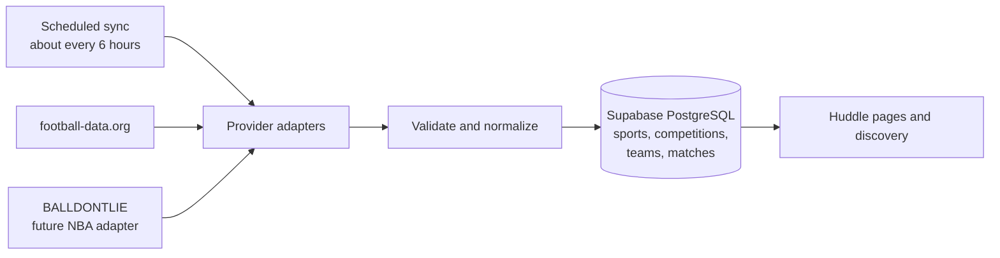

# Huddle

**Find your people for every match.**

Huddle is a social web application for finding safe, relevant places and communities to watch sports. Fans follow sports, competitions, teams, and venues, and join supporter groups; Huddle then connects upcoming fixtures to nearby watch events they are actually allowed to see and attend.

This is a two-person final project for the **Full-Stack & AI** course. The submitted application is an English-language pilot for Israel.

## The problem

Sports are better with other people, but it can be difficult to find nearby fans of the same team or a venue showing a particular match. The problem is especially noticeable for people who are new to a city, support a foreign team, or follow a less popular competition.

Huddle answers:

> **Who near me is watching this match, and where may I safely join them?**

## The core experience

1. Create and verify an account, complete a profile, and accept the community rules.
2. Follow sports, competitions, teams, and venues, and join supporter groups.
3. Browse synchronized upcoming fixtures and discover eligible watch events nearby.
4. Join a public venue event, or request access to an eligible private event.
5. Host and manage a gathering, its capacity, invitations, and attendance.
6. Download an approved event as an `.ics` calendar file.

## People, groups, and venues

Huddle has two intentionally different hosting models.

### Private people

Private people can create events for:

- a supporter group they belong to;
- accepted friends;
- specifically invited Huddle members.

A private person cannot publish an event to the general public or to every follower of a team, even when the event takes place in a café or another public place.

Home events require host approval, are limited to 12 registered Huddle accounts, do not allow anonymous plus-ones, and keep their exact address in protected storage. Friendship or group membership alone never reveals a home address.

### Supporter groups

Groups provide the community layer between a private friendship and a public venue listing. They support:

- discoverable and unlisted groups;
- membership applications and expiring invite links;
- `owner`, `admin`, and `member` roles;
- rules, bans, and group-event approval;
- duplicate-group suggestions based on team and city.

Members may propose group events, but an owner or admin approves publication. A new discoverable group must meet a minimum safety and activity threshold before appearing in search.

### Businesses and venues

Venue profiles represent sports bars, cafés, and similar businesses. Venue-hosted events may be:

- `public` — visible and joinable by eligible Huddle members;
- `team_followers` — publicly visible, but attendance normally requires following the selected team.

The course MVP allows an eligible user to create a visibly **unverified** venue profile without payment. Paid venue subscriptions, promotions, menus, analytics, and commercial entitlements are later business features.

## Sports data: synchronized, normalized, and stored locally

Huddle does **not** call a sports API whenever somebody opens a page. External sports data is imported on a schedule, normalized, and stored in Supabase PostgreSQL. Normal application requests read this local catalog, so browsing remains fast and previously synchronized fixtures remain usable if a provider is temporarily unavailable.



The scheduled job runs approximately every six hours—four times per day—and synchronizes a bounded window from yesterday through roughly 45 days ahead. It upserts changed records instead of downloading the entire catalog on every request. A failed run records the error and freshness state without deleting the last good data.

The backup unit is the whole PostgreSQL database, not a separate sports-data dump. Whole-database backups preserve the relationships between matches and Huddle events. The schema and deterministic seed data live in Git migrations; provider-owned catalog data can also be rebuilt by rerunning synchronization. Matches referenced by Huddle events are retained rather than deleted when they leave the active synchronization window.

This is an operational local copy/cache, not a dump of raw provider responses. Huddle stores only the normalized fields the product needs:

| Table | Examples of stored data |
|---|---|
| `sports` | Football, basketball |
| `competitions` | Premier League, Champions League, NBA |
| `teams` | Arsenal, Real Madrid, Boston Celtics |
| `matches` | Competition, home team, away team, UTC start time, status, season/stage |
| `provider_sync_runs` | Provider, sync window, outcome, request count, changed rows, safe error summary |

Football fixtures and NBA games use the **same `matches` table**. They are not stored in separate football and basketball schemas. A provider adapter converts each API response into the same internal shape, while `(provider, provider_external_id)` preserves the source identity and prevents ID collisions between APIs.

The primary match indexes are:

- `(competition_id, starts_at)` for a league or tournament schedule;
- `(home_team_id, starts_at)` and `(away_team_id, starts_at)` for a team's fixtures;
- `(starts_at, status)` for upcoming scheduled matches;
- unique `(provider, provider_external_id)` for safe repeated upserts.

The submitted implementation remains **football-first**: [football-data.org](https://www.football-data.org/documentation/quickstart) is the first adapter. The storage and provider contract are deliberately sport-neutral so an NBA adapter using [BALLDONTLIE](https://docs.balldontlie.io/) writes to the same catalog without changing events, follows, or discovery. NBA integration itself remains a post-MVP extension unless the core football flow is completed early.

## Submitted MVP

- Email/password authentication with verified email, 18+ attestation, current community-rules acceptance, and profile completion.
- Football catalog and upcoming fixtures synchronized from an external provider.
- Follows for sports, competitions, teams, and venues.
- Mutual friendships with no friends-of-friends visibility.
- Discoverable and unlisted supporter groups with applications, roles, invitations, bans, and event review.
- Private-person events limited to group, friends, or invite-only audiences.
- Business-venue events with public or team-follower audiences.
- Israel city-based discovery, optional browser geolocation, and PostGIS distance queries.
- Attendance request, approval, decline, removal, and leave flows with atomic capacity enforcement.
- Protected home locations, blocking, reporting, moderation, and audit records.
- RFC 5545 `.ics` calendar download.
- Automated tests, CI, public Vercel deployment, and Supabase-managed Auth/PostgreSQL.

## Architecture and course stack

Huddle is designed as a modular monolith: one Next.js application contains the UI and backend boundaries, while Supabase provides managed authentication and PostgreSQL.

| Area | Technology | Responsibility |
|---|---|---|
| Web application | Next.js App Router, React, strict TypeScript | Pages, Server Components, Server Actions, and Route Handlers |
| UI | Tailwind CSS, Radix UI primitives | Responsive and accessible interface |
| Validation | Zod | Forms, environment variables, route input, and provider responses |
| Authentication | Supabase Auth | Verified users and cookie-based SSR sessions |
| Database | Supabase PostgreSQL, RLS, PostGIS | Durable data, authorization, atomic attendance, and nearby discovery |
| Sports ingestion | Provider adapters, Supabase Cron, protected Next.js route | Scheduled fixture synchronization and normalization |
| Testing | Vitest, React Testing Library, Playwright, pgTAP | Domain, UI, end-to-end, schema, and RLS coverage |
| Delivery | GitHub Actions, Vercel, Supabase | CI, deployment, database, and hosting |

There is no separate Express service, ORM, Redis cache, WebSocket layer, payment system, or microservice architecture in the MVP. The expected course scale is better served by a clear Next.js backend, indexed PostgreSQL queries, scheduled sports-data synchronization, and cursor pagination.

## Safety boundaries

- Row Level Security is enabled on every exposed Supabase table and access is denied by default.
- Public views contain only safe venue, match, group, and event summaries.
- Exact home locations live separately and are exposed only through an audited authorization check.
- Blocks immediately end private interaction and can revoke future event/address access.
- Attendance approval is atomic, so concurrent approvals cannot exceed capacity.
- Reports are confidential from the reported user and group administrators; moderation actions are auditable and appealable.
- Provider keys, service credentials, private addresses, session data, and invite tokens are never sent to the browser or committed to Git.

## Deferred beyond the MVP

- NBA provider integration and live scores;
- chat, realtime match threads, and notifications;
- ratings, reviews, and numeric reputation;
- maps and paid address autocomplete;
- Google Calendar OAuth;
- Stripe subscriptions, payments, ticketing, menus, offers, analytics, and promoted listings;
- AI recommendations, automatic event creation, and AI moderation.

The database and provider boundaries may be future-ready, but deferred features will not appear as fake controls or half-implemented product flows.

## Project status

The merged baseline includes the Next.js application foundation, F02 application boundaries, and F03 local Supabase foundation. B01 is now in reciprocal review with repository CI plus local email/password signup, email verification, cookie-backed SSR sessions, sign-in, and sign-out. Profile onboarding, community mutations, product tables, and hosted application environments remain later steps; the local B01 implementation does not mutate the shared Supabase organization.

### Visual system

Huddle uses a dark-first visual language built from Ink, Linen, Court Green, Forest, and warm supporting neutrals, with Familjen Grotesk as the interface typeface. Every approved swatch is available as a named Tailwind token, and shared UI consumes replaceable brand components rather than hard-coded logo geometry or colors. The palette and typography are adopted; the exact website mark remains intentionally easy to replace.

See the [Huddle brand system](./docs/HUDDLE-BRAND.md) for tokens, assets, accessibility constraints, and usage rules.

### Local application setup

The F01 toolchain baseline is Node.js `24.19.0` (Krypton LTS) with npm `11.17.0`. Both versions are recorded in the repository, application dependencies use exact versions in `package.json` and `package-lock.json`, and F03 pins the project-local Supabase CLI. A running Docker-compatible runtime is required for local Supabase.

Install dependencies and start the local stack:

```bash
cp .env.example .env.local
npm ci
npm run db:start
npm run db:reset
npm run dev:local
```

The first database start downloads the pinned local images. Repository scripts use the pinned Supabase CLI and obtain its local-only values without printing credentials. `dev:local` injects those values only into the child Next.js process, so no local key copy is required. The ordinary command remains available when `.env.local` already contains the intended environment:

```bash
npm run dev
```

`NEXT_PUBLIC_SUPABASE_URL`, `NEXT_PUBLIC_SUPABASE_PUBLISHABLE_KEY`, and `NEXT_PUBLIC_APP_URL` are browser-safe. `SUPABASE_SERVICE_ROLE_KEY`, `FOOTBALL_DATA_API_TOKEN`, and `SPORTS_SYNC_SECRET` are server-only and must never enter Client Components or logs. F02 reserves the protected service-role boundary but does not call it. F03 uses the repository-managed local stack only; no hosted project is linked or mutated.

The local stack is recreated entirely from tracked migrations and seed data. Mailpit captures verification emails at `http://127.0.0.1:54324`; it sends nothing externally. The stack is not linked to the shared Supabase organization and must not be exposed externally. See the [local database contract](./supabase/README.md) for schema conventions and database commands.

Before handing off B01, install Chromium once and run the repository gates:

```bash
npx --no-install playwright install chromium
npm run test:coverage
npm run test:db
npm run db:types:check
npm run format:check
npm run lint
npm run typecheck
npm run build:local
npm run test:e2e
```

The tracked GitHub Actions workflow runs the same local-only stack on pull requests and `main`. The protected `main` branch requires the `Repository gates` check, one approving partner review, resolution of review conversations, and an up-to-date branch before merge; force pushes and deletion are disabled.

- [Product and architecture vision](./docs/HUDDLE-ARCHITECTURE.md)
- [Implementation-ready engineering specification](./docs/HUDDLE-IMPLEMENTATION-SPEC.md)
- [Step-by-step two-person build specification](./docs/HUDDLE-STEP-BY-STEP-BUILD-SPEC.md)
- [Brand system and asset rules](./docs/HUDDLE-BRAND.md)
