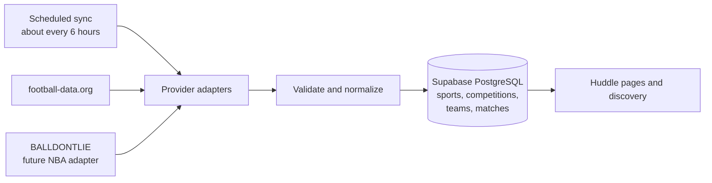

# Huddle

**Find your people for every match.**

Huddle is a social web application for finding safe, relevant places and communities to watch sports. Fans follow sports, competitions, teams, and venues, and join social or team-linked groups; Huddle then connects upcoming fixtures to nearby watch events they are actually allowed to see and attend.

This is a two-person final project for the **Full-Stack & AI** course. The submitted application is an English-language pilot for Israel.

Submission hardening passed local acceptance and required CI, then merged through [PR #58](https://github.com/gethuddle/huddle/pull/58) and deployed on 4 September. It includes full-app audit corrections, loading/navigation work, generated venue Huddle URLs with optional settings edits, live handle/URL availability, secure account email changes, complete fixture-event pagination, and correctly loaded local map workers. [Dated acceptance evidence](./docs/evidence/submission-hardening/ACCEPTANCE.md) separates those verified release results from later production-audit corrections and the remaining B13 presentation rehearsal.

A 5 September corrective performance slice removes the nav spinner, fixes serialized personalized reads at the database transaction boundary, deduplicates request-scoped identity work, and gives Explore an account-partitioned in-memory stale-while-revalidate cache without persisting private data. It passed complete local acceptance and required CI, merged through [PR #60](https://github.com/gethuddle/huddle/pull/60) as [`6280a45a`](https://github.com/gethuddle/huddle/commit/6280a45a377d1c89cf5cd6b6a205827690fc0db6), and was deployed with matching migration `20260904170000`. The exact Vercel build serves `huddle.co.il` from `fra1`; signed-in production checks found no nav indicator or browser error, hard-loaded Fan Home in 586–775 ms, and switched the tested Fan/Venue tabs in 329–752 ms. The same [dated acceptance evidence](./docs/evidence/submission-hardening/ACCEPTANCE.md) records the exact gates and claim boundary.

The merged full Fan-navigation follow-up explicitly warms every non-current primary Fan destination in Next.js's private per-tab Router Cache, including Home and Ask Huddle, while leaving Venue and billing routes outside this full-prefetch policy and persisting no account data. It also replaces Fan Home's five database round trips with one authenticated, actor-scoped read projection. Production tracing confirms that settled Home, Explore, Ask Huddle, My Huddle, and People clicks start no destination RSC request; two hard Home samples loaded in 697–791 ms. A final bounded Explore follow-up replaces its repeated authorized geospatial scans and separate enrichment wave with one private no-store RPC; complete local acceptance is recorded while publication and comparable production remeasurement remain pending. [Dated acceptance evidence](./docs/evidence/submission-hardening/ACCEPTANCE.md) records the exact gates and claim boundaries.

The approved post-B12 redesign gives one Supabase login two separately authorized, optional workspaces: **Fan** for attendance and private social activity, and **Venue** for commercial operations. This deliberately supersedes the older assumptions that every completed personal profile may create a venue, that every group-organized event must wait for a separate owner/admin review, and that every venue event needs a capacity-backed guest list. The project-status history below remains evidence of what was merged before the redesign, not the current permission contract.

The approved `VB01` contract adds one Polar **Sandbox** subscription per commercial venue before it may appear publicly, be found in Explore, or publish venue events. It replaces the old immediate-public activation rule. Local VB01 acceptance passed in an isolated disposable project: clean install, six forward billing migrations, schema lint, 48 pgTAP files / 2,423 assertions, canonical generated-type parity, 223 Vitest files / 1,308 tests plus one intentional skip (80.42% statements, 71.87% branches, 83.53% functions, 84.62% lines), production build, 37 Playwright tests, security audit, and diff hygiene. Polar transport was denied throughout automation. The authorized hosted Sandbox happy path passed on 4 September 2026: two independent venue subscriptions, genuine signed activation, public/Explore visibility, owner portal, duplicate protection, and one distant demo event. [Dated acceptance evidence](./docs/evidence/vb01/ACCEPTANCE.md) records the deployment, migrations, secret maintenance, and remaining broader hosted checks. Fan, friendship, group, RSVP, and private-hosting features stay free; Sandbox checkout processes no real money; payment never changes the visible **Unverified** trust label. See the [normative entitlement rules](./docs/HUDDLE-IMPLEMENTATION-SPEC.md#28-commercial-boundary-and-vb01-venue-entitlement).

The 31 August discovery-consistency revision makes a described owner-backed group searchable without fake activity quotas, lets eligible Fans find public-place events from discoverable groups before applying, keeps group home events private, preserves managed-Venue listings when switching to Fan Explore, lists visible watch events on their fixture pages, and gives group owners a safe Delete group flow backed by audited archival retention.

The current Calm Explore revision replaces the dark, route-heavy interface with a light-first, border-led hierarchy; combines fixture, date, team, area, event, group, list, and map discovery under Explore; adds repository-owned team marks; completes friendship and invitation outcomes; provides secure event invite links; and gives Venue owners an audited Close venue action. The [86-action flow matrix](./docs/evidence/calm-explore/ACTION-MATRIX.md) and [bounded final UX audit](./docs/evidence/calm-explore/UX-AUDIT.md) record the current behavior and evidence.

The approved cityless-location revision removes the redundant city catalog and every city selector. Explore uses either the browser's current position or a confirmed OpenStreetMap/Photon address for session-only distance ranking; public places and venues store confirmed coordinates, while exact home coordinates stay in the protected location domain. Groups have no locality and public groups are ranked globally by active-member count. Official football-data crest URLs flow through the local catalog to every shared team-mark surface, with accessible initials when artwork is unavailable.

The approved AI-assisted discovery revision adds a dedicated active-Fan **Ask Huddle** destination. Its full-height shadcn chat interface uses an edge-to-edge conversation canvas, separately bordered phone-dense event tickets, and a two-row docked composer rather than a nested popup. It holds only the current question and answer; leaving the route clears them, and every new question replaces the prior exchange. Cloudflare Workers AI sees only the short sentence and current Israel time and returns a bounded intent; Huddle's local catalog and Supabase authorization resolve friendships, group membership, event visibility, location, facilities, capacity, and the deterministic top three. The 14-day window applies only when no date expression exists. Single dates, weekdays, relative dates, named months, and explicit ranges are resolved deterministically in Israel time and never silently fall back to that default. A named public Israel place overrides remembered coordinates and is resolved server-side through the bounded Photon/OpenStreetMap adapter before the authorized search runs, without sending coordinates or account data to the model. Results retain team crests, related group context, attendance detail, participation state, facilities, and safe fallbacks. Leaving a reservation keeps its audit/history row but makes an otherwise actionable event discoverable again in both Explore and Ask. There is no conversational context, RAG, AI-written event content, or private account context in the model request.

The approved authentication hardening keeps Supabase as the credential authority while closing browser-flow ambiguity: duplicate signup and recovery requests remain generic, new passwords use a 15–72-character policy, email credentials stay in a fragment until an explicit same-origin confirmation, recovery updates require a five-minute user/session-bound grant, and ordinary password changes require the current password in Account Security. Successful replacements request global session revocation, always clear the current Huddle session and namespaced browser state, and trigger a branded security email; if Supabase cannot confirm revocation, sign in shows an honest warning. Cloudflare Turnstile is an optional fail-closed gate on signup, sign-in, and recovery request forms; it does not receive Huddle account data.

The approved 3 September account-erasure revision makes Account Security the home for both password changes and immediate, irreversible account deletion. Deletion requires the current password and exact `DELETE`, then one actor-serialized transaction removes public identity, private relationship/follow data, application prose, drafts, and exact hosted-home locations; cancels future live activity; archives owned groups and Venues; and leaves only required attendance, ownership, membership-lifecycle, authorship, moderation, appeal, and audit history under a `Deleted account` tombstone. Only active invite tokens are revoked, concurrent actor writes share the same lock, retries reconcile residue without a second audit, and stale JWTs cannot read retained private history or mutate. The current pre-`VB01` flow soft-deletes the same Supabase Auth user after database preparation. `VB01` supersedes that direct ordering only for billing-aware V2 erasure: required Polar Sandbox external-customer anonymization and guarded local cleanup complete before Auth deletion, while legacy V1 fails closed before commit if cleanup would be needed. A short-lived HttpOnly completion marker lets the isolated landing page clear Huddle-owned tab storage without trusting a query string, then is consumed so later anonymous state survives. Ordinary sign-out guarantees local cookie cleanup even across a provider transport failure and uses the same one-time marker boundary. No email digest or recovery window remains.

## The problem

Sports are better with other people, but it can be difficult to find nearby fans of the same team or a venue showing a particular match. The problem is especially noticeable for people who are new to a city, support a foreign team, or follow a less popular competition.

Huddle answers:

> **Who near me is watching this match, and where may I safely join them?**

## The core experience

1. Create and verify an account, recover a forgotten password when needed, attest that you are 18+, accept the current community rules, and choose Fan or Venue setup.
2. Optionally activate Fan to follow interests, attend, use friendships and groups, and host private events.
3. Browse synchronized upcoming fixtures and discover eligible watch events nearby.
4. See that a venue is open for a fixture, reserve a place when that venue uses reservations, or request access to an eligible private event.
5. Host and manage a private gathering as a Fan, or operate commercial events through an active Venue membership.
6. Return to My Huddle to find every hosted/submitted event, invitation, attendance state, and active owned/joined group.
7. Find another member by name or handle, send a direct friend request, and share eligible event or group links.
8. Download an approved event as an `.ics` calendar file.

## People, groups, and venues

Huddle has two intentionally different hosting models.

### Private people

Private people can create events for:

- a supporter group they belong to;
- accepted friends;
- specifically invited Huddle members.

A private person cannot publish an event to the general public or to every follower of a team, even when the event takes place in a café or another public place.

Home events require host approval, are limited to 12 registered Huddle accounts, do not allow anonymous plus-ones, and keep their exact address in protected storage. Friendship or group membership alone never reveals a home address.

### Groups

Groups provide the community layer between a private friendship and a public venue listing. A group may be a team-linked supporter community or a general private/social circle. They support:

- discoverable and unlisted groups;
- membership applications and expiring invite links;
- `owner`, `admin`, and `member` roles;
- rules, bans, and group-event approval;
- duplicate-group suggestions based on name and optional team association.

An event authored by a current group owner or admin publishes atomically without self-review. An ordinary member may propose an event, but it remains pending until a different current owner or admin publishes or rejects it. Promotion after submission never lets the creator decide their own pending event. A discoverable group appears in search once its owner is active and it has a clear description; members, additional admins, rules, and events are optional rather than artificial launch quotas.

### Businesses and venues

Venue profiles represent sports bars, cafés, and similar businesses. Venue-hosted events may be:

- `public` — visible and joinable by eligible Huddle members;
- `team_followers` — publicly visible, but attendance normally requires following the selected team.

For a `public` fixture, the venue chooses one plain attendance mode:

- **Open door** — fans just come along. Huddle shows no capacity, RSVP, invitation, approval queue, guest list, or claim that admission is reserved.
- **Reservations** — one active Fan account reserves one place, optionally after venue approval, with atomic capacity enforcement.

The Venue planner begins with bounded, searchable fixture cards. Selecting one carries its synchronized date and kickoff automatically; venue details, address, house information, viewing areas, and the usual attendance mode are reused instead of being entered again for every fixture.

Under approved `VB01`, a commonly eligible venue operator self-serves a private, visibly **Unverified** venue draft without Fan activation. Verified email, 18+ attestation, current community-rules acceptance, venue information, a truthful business-representation attestation, and a non-suspended account atomically create the draft, owner membership, Venue workspace, and inactive per-venue entitlement. The venue remains hidden until a signed Polar Sandbox webhook activates it. Owners/admins operate the venue; only its exact owner handles checkout/portal/cancellation. The hidden-draft and signed-activation journey was verified on the live Sandbox pilot on 4 September 2026.

A venue is never an attendee and never consumes capacity. A human who also activates Fan may attend through that Fan identity, where one registered account still represents one attendee.

## Sports data: synchronized, normalized, and stored locally

Huddle does **not** call a sports API whenever somebody opens a page. External sports data is imported on a schedule, normalized, and stored in Supabase PostgreSQL. Normal application requests read this local catalog, so browsing remains fast and previously synchronized fixtures remain usable if a provider is temporarily unavailable.



The scheduled job runs approximately every six hours—four times per day—and synchronizes a bounded window from yesterday through the end of the current football season on May 31. It upserts changed records instead of downloading the catalog on page requests. A failed run records the error and freshness state without deleting the last good data.

The backup unit is the whole PostgreSQL database, not a separate sports-data dump. Whole-database backups preserve the relationships between matches and Huddle events. The schema and deterministic seed data live in Git migrations; provider-owned catalog data can also be rebuilt by rerunning synchronization. Matches referenced by Huddle events are retained rather than deleted when they leave the active synchronization window.

This is an operational local copy/cache, not a dump of raw provider responses. Huddle stores only the normalized fields the product needs:

| Table | Examples of stored data |
|---|---|
| `sports` | Football, basketball |
| `competitions` | Premier League, Champions League, NBA |
| `teams` | Arsenal, Real Madrid, Boston Celtics |
| `matches` | Competition, home team, away team, UTC start time, status, season/stage |
| `provider_sync_runs` | Provider, sync window, outcome, request count, changed rows, safe error summary |

Football fixtures and NBA games use the **same `matches` table**. They are not stored in separate football and basketball schemas. A provider adapter converts each API response into the same internal shape, while `(provider, provider_external_id)` preserves the source identity and prevents ID collisions between APIs.

The primary match indexes are:

- `(competition_id, starts_at)` for a league or tournament schedule;
- `(home_team_id, starts_at)` and `(away_team_id, starts_at)` for a team's fixtures;
- `(starts_at, status)` for upcoming scheduled matches;
- unique `(provider, provider_external_id)` for safe repeated upserts.

The submitted implementation remains **football-first**: [football-data.org](https://www.football-data.org/documentation/quickstart) is the first adapter. The storage and provider contract are deliberately sport-neutral so an NBA adapter using [BALLDONTLIE](https://docs.balldontlie.io/) writes to the same catalog without changing events, follows, or discovery. NBA integration itself remains a post-MVP extension unless the core football flow is completed early.

## Submitted MVP

- Email/password authentication, passive explicit verification, non-enumerating and session-bound password recovery, current-password Account Security for password change and immediate exact-confirmation account erasure, common safety eligibility, optional Fan activation, and locally accepted `VB01` self-serve Unverified Venue activation with a verified hosted Sandbox happy path; broader B13 acceptance remains pending.
- Football catalog and upcoming fixtures synchronized from an external provider.
- Follows for sports, competitions, teams, and venues.
- Mutual friendships with no friends-of-friends visibility.
- Safe signed-in people search by display name or handle.
- Discoverable and unlisted groups, with optional team association, applications, roles, invitations, bans, atomic owner/admin-authored event publication, and different-owner/admin review of ordinary-member submissions.
- Owner-only group deletion through audited archive, with live events/invites closed and safety history retained.
- Private-person events limited to group, friends, or invite-only audiences.
- Business-venue events with public or team-follower audiences, fixture-first batch planning, public open-door listings or optional registered reservations, authorized by active Venue membership and never attended by the venue itself.
- Origin-based discovery across the Israel pilot using browser location, Photon/OpenStreetMap address suggestions, and PostGIS distance ranking across city borders, with managed-Venue continuity in Fan Explore and signed-in acquisition previews for discoverable-group public-place events.
- Reservation attendance request, approval, decline, removal, and leave flows with atomic capacity enforcement; open-door venue listings deliberately have no attendance state.
- Protected home locations, blocking, reporting, moderation, and audit records.
- RFC 5545 `.ics` calendar download.
- A personal My Huddle home for actively owned/joined groups plus hosted, submitted, invited, requested, and attending events.
- A one-shot AI-assisted active-Fan Ask destination for fixture, weekday/date/month, named public search area, relationship, venue, and venue-facility intent, returning at most three authorized event cards.
- Automated tests, CI, public Vercel deployment, and Supabase-managed Auth/PostgreSQL.

## Architecture and course stack

Huddle is designed as a modular monolith: one Next.js application contains the UI and backend boundaries, while Supabase provides managed authentication and PostgreSQL.

| Area | Technology | Responsibility |
|---|---|---|
| Web application | Next.js App Router, React, strict TypeScript | Pages, Server Components, Server Actions, and Route Handlers |
| UI | Tailwind CSS, repository-owned shadcn components, Radix UI primitives | Branded, reusable, and accessible interface |
| Validation | Zod | Forms, environment variables, route input, and provider responses |
| Authentication | Supabase Auth | Verified users and cookie-based SSR sessions |
| Database | Supabase PostgreSQL, RLS, PostGIS | Durable data, authorization, atomic attendance, and nearby discovery |
| Sports ingestion | Provider adapters, Supabase Cron, protected Next.js route | Scheduled fixture synchronization and normalization |
| AI intent extraction | Cloudflare Workers AI REST API from a Vercel Route Handler | Convert one sentence into a strict, untrusted search intent; never authorize or rank data |
| Testing | Vitest, React Testing Library, Playwright, pgTAP | Domain, UI, end-to-end, schema, and RLS coverage |
| Delivery | GitHub Actions, Vercel, Supabase | CI, deployment, database, and hosting |

There is no separate Express service, ORM, Redis cache, WebSocket layer, real-money payment system, or microservice architecture in the MVP. The approved `VB01` Polar Sandbox per-venue entitlement is locally accepted across its SDK/database, owner checkout, webhook/enforcement, deadline, and offline-fixture paths; its authorized hosted happy path is verified. It is not a real-payment system, and broader B13 acceptance remains separate. The expected course scale is better served by a clear Next.js backend, indexed PostgreSQL queries, scheduled sports-data synchronization, and cursor pagination.

## Safety boundaries

- Row Level Security is enabled on every exposed Supabase table and access is denied by default.
- Public views contain only safe venue, match, group, and event summaries.
- Exact home locations live separately and are exposed only through an audited authorization check.
- Blocks immediately end private interaction and can revoke future event/address access.
- Attendance approval is atomic, so concurrent approvals cannot exceed capacity.
- Reports are confidential from the reported user and group administrators; moderation actions are auditable and appealable.
- Account erasure is fail-closed across both central actor gates and direct retained-history RLS reads. Its only exact-home-location guard exception is deletion after the direct host has already been tombstoned; ordinary live-home invariants remain unchanged.
- Provider keys, service credentials, private addresses, session data, and invite-token digests are never sent to the browser or committed to Git. A group-invite plaintext secret is shown once to its authorized creator, travels only through the intended join URL, and is never persisted or logged.
- Assisted discovery never sends the model an actor ID, friend/group list, coordinate, attendance state, event row, result, or private address; raw sentences and named-place phrases are not retained in Huddle logs, tokens, or tables.

## Deferred beyond the MVP

- NBA provider integration and live scores;
- chat, realtime match threads, and notifications;
- ratings, reviews, and numeric reputation;
- route planning and paid address autocomplete beyond the implemented Photon/OpenStreetMap search and public-event map;
- Google Calendar OAuth;
- real-money/production payments, Stripe, ticketing, menus, offers, analytics, and promoted listings;
- generative recommendations, automatic event creation, AI moderation, agents, RAG, and conversational history beyond the bounded intent extractor.

The database and provider boundaries may be future-ready, but deferred features will not appear as fake controls or half-implemented product flows.

## Project status

The merged baseline includes B01–B12: repository CI; account verification and onboarding; the normalized sports catalog; Huddle-styled shadcn/Radix UI; fixture browsing and follows; friendships and supporter groups; venue and private/group event hosting; safe geospatial discovery; invitations, atomic attendance, protected locations and calendars; confidential reporting, moderation, appeals, hardening, accessibility, and operational runbooks; and the B12 release-candidate and automated-acceptance milestone, including its complete 17-journey gate and production-found corrections to navigation, verification/onboarding, city availability, discovery failure handling, and fixture pagination. [PR #33](https://github.com/gethuddle/huddle/pull/33) merged as accepted SHA [`94c99156011ae20fdcdbe14b807b5884cfe77555`](https://github.com/gethuddle/huddle/commit/94c99156011ae20fdcdbe14b807b5884cfe77555) and closed [issue #32](https://github.com/gethuddle/huddle/issues/32). AI01 then merged through [PR #46](https://github.com/gethuddle/huddle/pull/46) as [`93293fbc`](https://github.com/gethuddle/huddle/commit/93293fbc03a52e835771b9234abdd7eba6a02a40) and was explicitly enabled in production. `VB01` merged through [PR #56](https://github.com/gethuddle/huddle/pull/56) as `83555e1c`; its authorized hosted Sandbox happy path passed on 4 September 2026 after local acceptance. Submission hardening then merged through [PR #58](https://github.com/gethuddle/huddle/pull/58) as [`9a485916`](https://github.com/gethuddle/huddle/commit/9a4859168201589da3d3ab2a743ab163cc620a58) and was deployed with the 49 production migrations through `20260904164000` plus matching Auth configuration. The four existing venues received the fixed legacy grace, and only two labelled demo venues plus one demo event were added for the walkthrough. The ordinary local demo database was not reset. [VB01 evidence](./docs/evidence/vb01/ACCEPTANCE.md) distinguishes completed integration checks from unrun hosted lifecycle drills and B13. The production URL is [huddle.co.il](https://huddle.co.il). The B12 baseline originally contained 12 migrations; current post-B12 repository inventory is tracked in the submission test plan, while B13 exit evidence remains pending. Local development does not mutate a hosted Supabase project.

### Visual system

Huddle uses a light-first visual language built from a warm neutral canvas, white focused surfaces, Ink text, Court Green, Forest, and restrained warm supporting neutrals, with Familjen Grotesk as the interface typeface. Ordinary surfaces are border-led and shadow-free; floating layers use pale sage semantic elevation. Every approved swatch is available as a named Tailwind token. Repository-owned shadcn/Radix primitives provide reusable behavior while shared and feature UI applies Huddle's tokens and replaceable brand components rather than hard-coded logo geometry or colors. The palette and typography are adopted; the exact website mark remains intentionally easy to replace.

See the [Huddle brand system](./docs/HUDDLE-BRAND.md) for tokens, assets, accessibility constraints, and usage rules.

### Local application setup

The F01 toolchain baseline is Node.js `24.19.0` (Krypton LTS) with npm `11.17.0`. Both versions are recorded in the repository, application dependencies use exact versions in `package.json` and `package-lock.json`, and F03 pins the project-local Supabase CLI. A running Docker-compatible runtime is required for local Supabase.

Install dependencies and start the local stack:

```bash
cp .env.example .env.local
npm ci
npm run db:start
npm run db:reset
npm run dev:local
```

The first database start downloads the pinned local images. Repository scripts use the pinned Supabase CLI and obtain its local-only values without printing credentials. `dev:local` injects those values only into the child Next.js process, so no local key copy is required. The ordinary command remains available when `.env.local` already contains the intended environment:

```bash
npm run dev
```

`HUDDLE_ENVIRONMENT` labels the configuration as `local`, `preview`, or `production`. Hosted builds must also agree with Vercel's own environment label and use HTTPS. `.env.preview.example` and `.env.production.example` enumerate separate safe key names; preview must use its own non-production Supabase project. Vercel Preview builds derive `NEXT_PUBLIC_APP_URL` from the validated stable branch URL whenever Vercel supplies one, so a stale manual value cannot pin the next pull request to an old branch; non-Vercel preview hosts, local, and production configure an explicit canonical origin. Required Preview variables are project-wide so a new pull request cannot lose configuration merely because its branch name changed. `NEXT_PUBLIC_SUPABASE_URL`, `NEXT_PUBLIC_SUPABASE_PUBLISHABLE_KEY`, `NEXT_PUBLIC_APP_URL`, and the optional `NEXT_PUBLIC_TURNSTILE_SITE_KEY` are browser-safe. `SUPABASE_SERVICE_ROLE_KEY`, `FOOTBALL_DATA_API_TOKEN`, `SPORTS_SYNC_SECRET`, `DISCOVERY_CURSOR_SECRET`, `AUTH_RECOVERY_TOKEN_SECRET`, `TURNSTILE_SECRET`, `ASSISTED_DISCOVERY_TOKEN_SECRET`, `CLOUDFLARE_ACCOUNT_ID`, and `CLOUDFLARE_WORKERS_AI_API_TOKEN` are server-only and must never enter Client Components or logs. B03 creates a service-role client only after the internal route authenticates `SPORTS_SYNC_SECRET`; ordinary sessions cannot trigger a sync or mutate the catalog. B09 uses a separate high-entropy `DISCOVERY_CURSOR_SECRET` only to sign and verify filter-bound pagination cursors. Auth Turnstile and AI01 remain disabled unless their conditional provider variables are configured; the build validates each enabled-provider contract before deployment. The repository-managed local stack remains unlinked, so these commands do not mutate the shared Supabase organization.

B03's automated tests use only the sanitized fixtures under `tests/fixtures/football-data` and never call the provider. To perform a deliberate real-provider sync locally, put the intended local Supabase values, provider token, and a matching high-entropy sync secret in `.env.local`, run the application with `npm run dev`, and invoke:

```bash
npm run sports:sync
```

`dev:local`, CI, builds, and tests deliberately inject placeholder provider authority. The checked-in competition allowlist contains Premier League (`PL`) and UEFA Champions League (`CL`), both in football-data.org's free coverage as rechecked on 2026-08-28. Hosted scheduling is prepared under `supabase/production/` but must not be run until both partners explicitly approve the exact production targets and secrets.

The local stack is recreated entirely from tracked migrations and seed data. Mailpit captures verification emails at `http://127.0.0.1:54324`; it sends nothing externally. The stack is not linked to the shared Supabase organization and must not be exposed externally. See the [local database contract](./supabase/README.md) for schema conventions and database commands.

Before handing off a milestone, install Chromium once and run the repository gates:

```bash
npx --no-install playwright install chromium
npm run test:coverage
npm run db:lint
npm run test:db
npm run db:types:check
npm run format:check
npm run lint
npm run typecheck
npm run build:local
npm run test:e2e
```

B12 also provides one fail-fast local acceptance command that runs the entire sequence, including a clean lockfile install, security audit, and diff check:

```bash
npm run test:acceptance
```

AI01 adds an opt-in manual evaluation command for the fixed 46-query synthetic corpus. It is intentionally excluded from CI and consumes Workers AI quota, so run it only with deliberate local Cloudflare credentials:

```bash
CLOUDFLARE_ACCOUNT_ID=... \
CLOUDFLARE_WORKERS_AI_API_TOKEN=... \
npm run test:assisted-discovery:live
```

The latest merged AI01 follow-up, [PR #48](https://github.com/gethuddle/huddle/pull/48), passed 943 Vitest assertions with the one live-model test skipped, all 1,681 pgTAP assertions, generated-type drift, schema lint, production build, and all 32 Playwright journeys before merging as [`1afa392f`](https://github.com/gethuddle/huddle/commit/1afa392f756f76d591dae1a52027d2ab32fe5d49). On 2 September 2026, the credentialed 42-case evaluation passed every core, privacy, unsupported-scope, date-boundary, and supported-intent gate with prompt `ai01-v5`, including exact next-weekday and named-place queries. The checked-in corpus now contains 46 cases so named months, single dates, bare weekdays, and the date-free default remain explicit regression traits; those four deterministic additions do not require another model call. AI01 was explicitly enabled in production; checked-in environment examples remain safely disabled by default.

The attendance-rediscovery correction merged through [PR #49](https://github.com/gethuddle/huddle/pull/49). Its database regressions prove that an event stays out of Explore and general Ask while attendance is current, returns after the controlled leave transition while history remains, remains rediscoverable after an accepted direct invitation, and stays excluded when a new invitation is pending.

The account-erasure revision merged through [PR #54](https://github.com/gethuddle/huddle/pull/54). Its migration, Server Action, Account Security Danger zone, browser-state cleanup, purpose-bound auth-link handling, truthful password-change failure recovery, and lifecycle tests were deployed with matching production migration parity on 4 September 2026.

The accepted B12 local run passed 403 Vitest/unit/component tests, 975 pgTAP assertions, the generated-type check, the production build, and all 17 Playwright journeys. The current post-B12 inventory is maintained in the [submission test plan](./docs/submission/TEST-PLAN.md). Hosted acceptance and rehearsal evidence belong to B13 and remain pending.

Production smoke is intentionally separate from CI and requires dedicated credentials in ignored `.env.production-smoke.local`. Session-only and one-time product-mutation commands are documented in the [deployment runbook](./docs/operations/DEPLOYMENT.md); neither runs implicitly. Production uses custom Resend SMTP on the verified `auth.huddle.co.il` sending domain; repository-owned full email templates and the explicitly targeted `npm run auth:config:check` define the expected hosted state, including a 100-email/hour Supabase project cap. Resend's shared account allowance remains the outer delivery limit. The separately authorized guarded production Auth configuration apply and immediate exact check passed on 3 September 2026; fresh email/browser acceptance remains pending. Turnstile enablement and account-erasure migration deployment remain explicit hosted operations, never CI side effects.

The tracked GitHub Actions workflow runs the same local-only stack on pull requests and `main`. The protected `main` branch requires the `Repository gates` check, resolution of review conversations, and an up-to-date branch before merge; partner and automated reviews are recommended but not required, and the pull-request author may merge after those gates pass. Force pushes and deletion are disabled.

- [Product and architecture vision](./docs/HUDDLE-ARCHITECTURE.md)
- [Implementation-ready engineering specification](./docs/HUDDLE-IMPLEMENTATION-SPEC.md)
- [Step-by-step two-person build specification](./docs/HUDDLE-STEP-BY-STEP-BUILD-SPEC.md)
- [Brand system and asset rules](./docs/HUDDLE-BRAND.md)
- [Final-submission index](./docs/submission/README.md)
- [Deployment and production-acceptance runbooks](./docs/operations/DEPLOYMENT.md)
