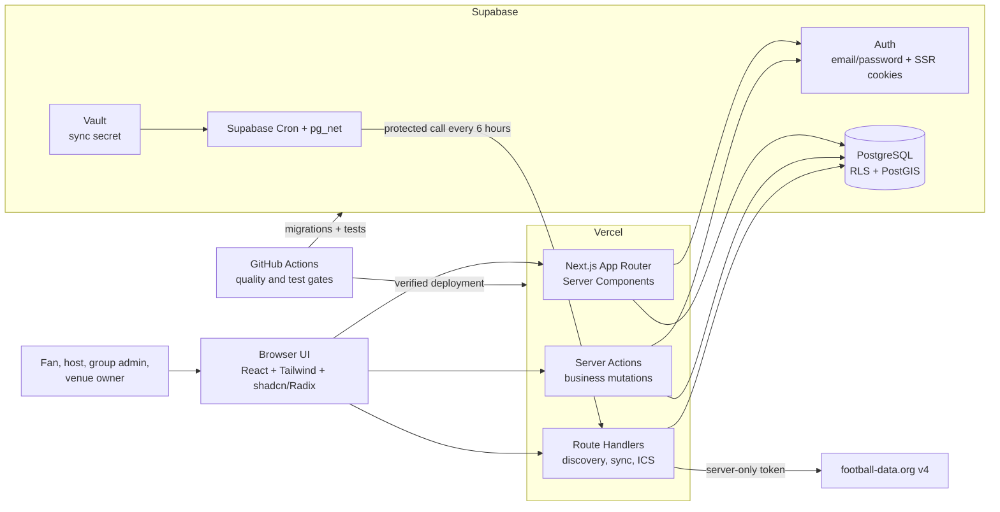

# Huddle: Product and Architecture Vision

**Document purpose:** explain what Huddle is, how its main pieces fit together, and why this is the right-sized architecture for the course project.

**Status:** implementation plan, not a claim that the application already exists.

**Pilot:** Israel, English interface, football first

**Default display time zone:** Israel time (implemented with the canonical IANA identifier `Asia/Jerusalem` for daylight-saving correctness)

**Required delivery stack:** Next.js, TypeScript, Supabase, and Vercel

**Approved post-B12 revision:** 30 August 2026. Huddle now has separately authorized Fan and Venue workspaces behind one Supabase login. This deliberately supersedes the B01–B12 assumptions that every completed personal profile may create a venue, that every group-organized event must wait for a separate owner/admin review, and that every venue listing needs a capacity-backed guest list. Historical milestone evidence remains a record of the merged baseline, not the current permission contract.

**Approved discovery consistency revision:** 31 August 2026. Searchable groups need an active owner and a useful description, not manufactured membership/activity quotas. Eligible signed-in Fans can discover public-place events from those groups and then apply before attending; home events stay member-only. Fan Explore includes public listings from Venues the same person manages, fixture pages list every event visible to the current viewer, and owner-facing group deletion is an audited archive that retains safety history.

**Approved location and catalog revision:** 31 August 2026. Public discovery starts from a browser coordinate or OpenStreetMap-backed address suggestion and ranks eligible results across city borders; profile city is only a fallback. Groups may keep an optional home area but are global communities. Scheduled football-data synchronization may retain a strictly allowlisted provider crest URL, while Huddle initials remain the resilient accessible fallback.

The source of truth for the course deliverables is the [official project brief](<../course-roadmap/project instructions.pdf>). The [course roadmap](../course-roadmap/ROADMAP.md) is a wider technology menu, not a requirement to use every tool mentioned in the lectures.

---

## 1. The product in one sentence

Huddle helps sports fans find trustworthy people and places nearby that are watching the same match, then lets them safely request a place, host a gathering, or publish a venue event.

## 2. Problem, users, customer, and value

Sports are social, but fans often do not know who nearby follows the same team or which venue will show a particular match. This is especially painful for people who are new to a city, support a foreign club, or follow a less popular competition.

Huddle answers: **“Who near me is watching this match, and where may I join them?”**

| Person | Need | Huddle's value |
|---|---|---|
| Fan | Find a suitable gathering for a match | A personalized, location-aware list connected to followed teams and competitions |
| Private host | Bring trusted people together without publishing a home address | Controlled audiences, approval, invitations, capacity, and protected location details |
| Supporter-group member | Build a lasting local community | Searchable or unlisted groups, membership approval, roles, and group events |
| Group administrator | Keep a group relevant and safe | Applications, invitations, event review, moderation, and bans |
| Venue owner | Reach the exact supporters likely to attend | A reusable venue profile, fixture-first batch planner, open-door listings, optional reservations, and followers |
| Platform moderator | Handle serious abuse without running every community | Reports, suspensions, and an audit trail |

The users are fans, hosts, group members/admins, and venue operators. A human may activate either or both workspaces, but each workspace is independently authorized. The future paying customer is the commercial venue. Ordinary fans, friendships, social/team-linked groups, and private hosting remain free.

### Business model boundary

The course MVP does **not** implement billing. A commonly eligible operator may self-serve a Venue workspace, with venue information and a truthful business-representation attestation, without first publishing a Fan identity. Activation atomically creates an immediately usable **Unverified** venue and one active owner membership; every commercial mutation requires an active Venue owner/admin membership. In a production version, venues would need an active subscription before publishing commercial listings.

Possible paid venue benefits are:

- scheduling events against future fixtures;
- visibly labelled promoted listings;
- menus and app-only offers;
- venue analytics;
- richer venue administration.

Promotion must never bypass distance, audience, privacy, moderation, or match relevance rules. Stripe, subscription entitlements, and webhooks are a later module rather than a half-built MVP feature.

---

## 3. Submitted MVP and future product

### Submitted MVP

- Email/password authentication, common safety eligibility, optional Fan activation, and self-serve Venue activation.
- Public browsing of information that is safe to expose.
- A football catalog and synchronized future fixtures.
- Follows for sports, competitions, teams, and venues.
- Mutual friendships, with no friends-of-friends access.
- Discoverable and unlisted groups, with optional team association.
- Group applications, roles, bans, invite links, atomic owner/admin-authored event publication, and review of ordinary-member submissions by a different current owner/admin.
- Fan-hosted events restricted to group, friend, or invite-only audiences.
- Venue-hosted events using public or team-follower audiences; public listings may be open-door with no Huddle reservation or guest list.
- City and optional browser-location discovery using PostGIS.
- Attendance request, approval, decline, host removal, leave, and capacity flows; no unregistered plus-one guests.
- A standards-based `.ics` calendar download.
- Minimal reports and platform moderation.
- Automated tests, CI, a Vercel deployment, and a Supabase database.

### Explicitly later

- chat, live threads, and realtime messaging;
- notifications and reminders;
- numeric reputation or endorsement scores;
- friends-of-friends visibility;
- live scores and NBA integration;
- route planning and paid address autocomplete beyond the implemented Photon/OpenStreetMap search and public-event map;
- Google Calendar OAuth;
- Stripe billing, menus, offers, or promoted ranking;
- payments, ratings, AI recommendations, and AI moderation.

This boundary keeps the submission small enough to explain and test while preserving the full core loop: **follow → discover → request/join → host/manage**.

---

## 4. System at a glance

### Normal request flow

1. The browser requests a page from Next.js.
2. A Server Component reads the signed-in session when needed and queries safe data from Supabase.
3. Supabase Row Level Security (RLS) independently checks which rows that user may read.
4. The server renders the initial page. Interactive filters and forms then run in small Client Components.
5. A mutation goes through a Server Action, which validates the input with Zod and applies the business transition.
6. Discovery JSON, sports synchronization, and calendar files use narrow Route Handlers.

There is no second Express application. Next.js is both the web frontend and the application backend.

### Sports-data flow

1. Supabase Cron calls a protected synchronization route every six hours.
2. The route calls football-data.org using a server-only token.
3. Provider responses are validated, normalized, and upserted into PostgreSQL.
4. Normal page requests read the local catalog; they never wait for the external provider.
5. If synchronization fails, cached fixtures remain usable and are marked stale.

---

## 5. The product blocks

### 5.1 Authentication and profiles

Supabase Auth owns passwords, email verification, and cookie-based sessions. Huddle owns the one-to-one human trust record: adult attestation, community-rules acceptance, suspension state, and optional public Fan identity. The course MVP is 18+; it records the attestation time rather than collecting a full birth date.

Common safety eligibility means verified email, adult attestation, current community-rules acceptance, and a non-suspended account. Fan activation is optional and adds a public display name, unique handle, and pilot city. Following, attendance, friendships, groups, and private hosting require Fan activation. Venue-only onboarding may satisfy common safety eligibility while leaving Fan identity fields incomplete and non-public; commercial venue mutations require active Venue membership instead of an invented Fan identity.

This is the first trust layer. It is deliberately simple: no social login in the MVP and no application-managed password table.

### 5.2 Football catalog and fixture synchronization

Huddle stores provider-independent records for sports, competitions, teams, and matches. The first adapter uses [football-data.org v4](https://www.football-data.org/documentation/quickstart). The free plan is suitable for a football-first course pilot, but its token and rate limit make local caching essential.

Provider IDs are integration details, not Huddle's public identity. A future NBA adapter can produce the same normalized competition/team/fixture shapes without changing events or discovery.

Required provider attribution appears in the footer and data-sources page. The scheduled adapter may retain the provider's HTTPS crest URL from its dedicated crest host. Product pages use that cached URL without a page-time provider API call, identify it as provider-supplied rather than Huddle-owned, and fall back to Huddle's text-initial mark whenever it is missing or cannot load.

### 5.3 Follows

A user can follow a sport, competition, team, or venue. Follows shape the discovery feed and are also an eligibility rule for a business venue's `team_followers` event. They do not let a private person publish to strangers and never grant private-address access.

The database prevents duplicate follows. Unfollowing changes future personalization but does not silently remove an already approved attendance record.

### 5.4 Friendships

Friendship is mutual. One user requests; the other accepts or declines. Only an accepted friendship grants visibility to a friends-only event. There is no friends-of-friends expansion because it would make privacy difficult to explain and enforce.

Blocking is immediate and does not require a report or moderator. It removes any friendship, prevents new friend requests and direct invitations, and hides future private events hosted by either person from the other. If the blocked relationship includes attendance at a future home event hosted by either person, attendance and future address access are revoked. A shared supporter-group membership is not automatically deleted; the affected user can also report the behavior or ask group admins to act. Huddle does not tell the blocked user who blocked them.

### 5.5 Groups

Groups are stronger community boundaries than friendships. A group may optionally identify with one team, but it may also represent a general/private social circle. Product-wide navigation therefore calls the complete domain **Groups**. A group may be:

- **discoverable** — eventually appears in search, but joining always needs an application and admin review;
- **unlisted** — does not appear in global search and is reached using a revocable invite link; the link still does not bypass admin approval.

A new discoverable group begins in `forming`. It enters search as soon as its owner remains active and it has a clear description. Members, additional admins, rules, events, and a home-area city enrich the community but do not gate search or membership. During creation, Huddle shows similar optional team/home-area groups to discourage duplicates without giving the platform a routine approval bottleneck.

Roles are `owner`, `admin`, and `member`. An event authored by a current owner/admin publishes atomically without self-review. An ordinary member may submit an event, but it remains pending until a current owner/admin whose user ID differs from the creator publishes or rejects it. Promoting the author after submission never permits self-approval or self-rejection. Admins may remove a member without banning them, or use the separate durable Ban action for a safety boundary. They may also invite one registered Fan directly; only that recipient can accept or decline. A reusable unlisted-group link remains a separate expiring, revocable application route. The owner may delete the live group through an audited archival transition that cancels future live group events and revokes usable invites without erasing membership or attendance history. Platform staff step in for reports and suspensions rather than operating every group.

### 5.6 Venue workspaces and profiles

A commonly eligible venue operator can self-serve activation with venue information and a truthful business-representation attestation. Activation atomically creates an immediately usable Unverified venue, one active owner membership, and its Venue workspace; it does not activate or publish a Fan identity. Every commercial read or mutation is authorized through an active `owner` or `admin` Venue membership, not merely a remembered workspace or legacy `owner_id`. Venue follows allow active Fans to track future listings.

The active owner may close the live venue through an audited archive transition. Closing removes the venue and workspace from live product reads, cancels future live venue events, revokes usable invitations, and prevents new commercial mutations without erasing membership, attendance, moderation, or security history. Archival is distinct from platform suspension and never rewrites verification status.

The **Unverified** label is always visible in the course MVP. It must not imply that Huddle has checked ownership, licensing, safety, or accessibility. Paid verification and commercial entitlements belong to the later subscription module.

### 5.7 Events and audiences

An event attaches to a real fixture when possible; fixture kickoff is inherited rather than re-entered. It has a host, place type, attendance mode, and exactly one audience policy. Reservation events also have a capacity and approval rule. The host type determines which audiences are even available:

| Host type | Allowed audiences | Meaning |
|---|---|---|
| Private person | `group` | Active, non-banned members may request; eligible signed-in Fans may preview a public-place event from an active discoverable group and apply before attending |
| Private person | `friends` | Only the host's accepted direct friends may see and request |
| Private person | `invite_only` | Only explicitly invited Huddle members may see and accept; a secure event-invite token may create that targeted invitation after an eligible account redeems it |
| Business venue | `public` | Everyone may see; open-door listings have no Huddle attendance state, while reservations accept eligible active Fans |
| Business venue | `team_followers` | Everyone may see; attendance requires an active Fan who follows the selected team unless directly invited |

This is a host rule, not a location rule. A private person using a café or other public place is still limited to group, friends, or invite-only. A discoverable group's public-place event can introduce an eligible signed-in Fan to that group, but it never becomes anonymous/public attendance and the Fan must join before requesting a place. A private host can never publish to all strangers or all followers of a team. Conversely, a business venue does not use private friendship/group audiences in the submitted MVP.

A public venue chooses `open_door` or `reservations` per event, with a reusable venue default. Open door means the venue is advertising that it will show the fixture: fans simply come along, Huddle does not reserve admission, and the product shows no capacity, RSVP, invitation, approval queue, or attendee history. Reservations keep the existing one-account-per-place model. Team-follower and all private events remain reservations.

An invite-only event's ordinary URL is not an access capability. A host may select registered people directly or create a high-entropy, expiring, revocable, usage-limited invite link. The link requires sign-in and eligibility, then creates a pending targeted invitation; the recipient still chooses Accept or Decline, and only acceptance reserves capacity. Huddle stores only the token digest and never logs or re-displays the plaintext after creation.

Fixtures are catalog data inside **Explore**, not a competing primary destination. Explore lets a visitor choose area, date/range, team, competition, or a specific fixture and then answers who is showing it nearby. Stable fixture object URLs remain for sharing and detail, while the `/matches` index redirects to Explore and preserves one navigation mental model.

### 5.8 Home-location safety

An exact home address and coordinate are stored separately from the public event row. Before approval, an eligible person can see the city and a coarse distance band, not the address or coordinate. Friendship or group membership alone never reveals the address. Home events have a hard MVP capacity limit of 12 registered Huddle attendees; there are no unregistered guests or plus-ones.

For a normal home-event request, the host must approve attendance before a protected database function returns the exact location. A directly invited user is pre-approved when they accept the invitation. Leaving, host removal, blocking, event cancellation, account suspension, or a group ban that removes eligibility revokes future address reads. Access to a private location is logged, but Huddle clearly warns that it cannot make a person forget or delete an address already viewed.

After the first attendee approval, a host cannot change the event's host type, audience, place kind, or home address. A material change requires cancellation and creation of a new event so every attendee makes a fresh consent decision.

### 5.9 Attendance and capacity

Reservation-mode venue events normally allow immediate Fan attendance, although their host can require approval. Private-person events require host approval unless the attendee was directly invited. A venue is never an attendee and never consumes capacity. The same human may attend only through a separately activated Fan identity, where one account still reserves exactly one place.

Pending requests do not consume capacity. Approval is one atomic database operation: lock the event, confirm permissions and eligibility, count approved attendees, check capacity, and update the record. This prevents two simultaneous approvals from taking the final seat. A host may remove an attendee; an attendee may leave at any time. Both transitions retain history and revoke private-location access. Cancellation retains all attendance records.

“RSVP” is the general response to an invitation or event. In Huddle, that response is represented explicitly as requested, approved, declined, left, or removed instead of being a vague counter. One account reserves exactly one place.

Open-door venue listings deliberately do not use that RSVP state machine. Database constraints require public venue hosting, null capacity, and no approval, while controlled functions reject invitation and attendance mutations. Discovery keeps these listings visible with explicit “no reservation” copy and never fabricates remaining places or a guest list.

### 5.10 Location-aware discovery

Fan onboarding keeps a profile city as useful fallback context, but Explore is not fenced to it. Huddle first reuses an already-granted browser coordinate when available, otherwise a session-scoped public origin or profile-city fallback; a permission prompt occurs only after “Use my location.” The user may search a city, neighborhood, street, or public address through an OpenStreetMap-backed suggestion service. Only the selected public coordinate reaches discovery, in a no-store request body rather than the URL. Protected-home text never enters that geocoder. PostGIS filters and ranks eligible events across city borders without returning a home coordinate.

The feed combines location, future time, followed interests, audience eligibility, match, and event status. It also merges and deduplicates public listings from Venues managed by the current Fan account, so switching workspaces does not make the person's own published event disappear. Fixture details use the same visibility boundary to list the watch events attached to that match. Results use cursor pagination so a larger catalog does not require loading or re-counting every earlier row.

### 5.11 Calendar export

An event page offers an RFC 5545 `.ics` download. It works with many calendar products and needs no Google account or OAuth integration. The export includes the exact home location only if the requesting user is the host or a currently authorized approved attendee; leaving, removal, blocking, banning, suspension, or cancellation removes it from future downloads.

### 5.12 Community rules, reports, and moderation

Every commonly eligible account accepts short, readable rules. They prohibit threats and planned fights; harassment, stalking, sexual misconduct, hate and discriminatory abuse; doxxing or sharing a home address; impersonation and venue fraud; scams, illegal goods, weapons, and dangerous activity; ban/block evasion; unapproved guests; and hidden commercial charges or affiliations. Team rivalry is never an excuse to threaten or target people.

Each event must honestly identify its host, location type, expected activity, costs, rules, and commercial affiliation. A named host or venue contact must be physically present. Application/request notes must not solicit sensitive information such as an address, phone number, financial data, health data, or full legal identity.

Users can block immediately and can report an event, group, venue, or profile before or after an event. Categories are immediate danger, harassment/stalking/sexual misconduct, hate/discrimination, privacy exposure, impersonation/fraud, dangerous or illegal activity, spam/scam, and other rule violation. Reporter identity is hidden from the reported person. Huddle is not an emergency service; imminent danger guidance points users to local emergency services.

Platform moderators use a private queue and proportional enforcement: content correction/removal, warning, feature restriction, temporary suspension, event cancellation or group/venue suspension, and permanent account ban for severe or repeated violations. Group administrators handle membership and group bans; they cannot resolve platform reports. Users receive a reason and may request an appeal/review.

Important decisions—attendance approval/removal, group approval, bans, moderation, appeals, and private-location reads—produce audit records without storing the exact address in the log.

### 5.13 Testing and delivery

The testing pyramid matches the risks:

- pgTAP verifies host/audience constraints, common safety and workspace gates, RLS, address revocation, roles, blocks, bans, and capacity concurrency;
- Vitest verifies domain rules, Zod schemas, provider normalization, and calendar output;
- React Testing Library verifies forms, permission-aware controls, and accessible UI states;
- Playwright verifies complete user journeys in a browser;
- GitHub Actions runs formatting, linting, types, tests, a local Supabase reset, the production build, and end-to-end tests.

Vercel hosts Next.js. Supabase hosts Auth and PostgreSQL/PostGIS. SQL migrations and seed data must reproduce the local project before a change may be deployed.

### 5.14 Basic scale

The MVP is a modular monolith designed for tens or hundreds of active users, with a clear growth path:

- fixtures are synchronized once and served locally;
- spatial and B-tree indexes match discovery and authorization queries;
- every large list is paginated;
- Server Components avoid unnecessary client waterfalls;
- database functions combine complex reads and atomic transitions;
- stable public catalog data may use short Next.js cache windows;
- provider failures do not take down user-facing pages.

If measurement later justifies it, add Redis for shared rate limits/cache, a queue for notifications and provider jobs, read replicas, dedicated search, paid hosting tiers, and a separate service only for a proven workload. These are growth steps, not launch dependencies.

---

## 6. Course technologies used deliberately

| Concern | Selected tool | Why it belongs in Huddle |
|---|---|---|
| Full-stack web | Next.js App Router + React | Required framework-compatible frontend and backend in one deployable app |
| Language | Strict TypeScript | Shared types and safer refactoring across UI, server, and provider adapters |
| UI | Tailwind CSS + repository-owned shadcn/Radix components | Branded reusable controls plus accessible primitives whose source stays in the repository |
| Server state | TanStack Query, narrowly | Interactive discovery pagination and attendance mutations benefit from cache/invalidation |
| Local UI state | React state | Forms and dialogs do not justify another global-state dependency |
| Validation | Zod | Untrusted form, URL, environment, and provider data need runtime checking |
| Database | Supabase PostgreSQL | Required managed relational database and a natural fit for connected social data |
| Authorization | Supabase RLS | Enforces row access at the data boundary as well as in application code |
| Geography | PostGIS | Indexed nearby-event and nearby-venue queries |
| Auth | Supabase Auth SSR | Verified email/password and secure cookie sessions without storing passwords ourselves |
| Tests | Vitest, RTL, Playwright, pgTAP | Covers domain code, components, browser journeys, and database security |
| CI/deploy | GitHub Actions + Vercel + Supabase | Matches the course's quality and deployment requirements |

The lectures also teach Express, Prisma, Redis, Zustand, Socket.IO, queues, payments, AI, and microservices. Learning a tool does not mean adding it where the product has no current need.

---

## 7. Decisions to keep the MVP understandable

| Not used initially | Reason | Add only when… |
|---|---|---|
| Separate Express server | Next.js already supplies Server Components, Actions, and Route Handlers; a second runtime adds deployment and auth complexity | A measured workload needs an independently deployed service |
| Prisma | Supabase SQL migrations, RLS policies, PostGIS functions, and generated DB types are clearer when PostgreSQL remains visible | The team later accepts the abstraction cost for a proven ORM benefit |
| Redis | Indexed PostgreSQL, local fixture caching, and Next.js caching are enough for course scale | Shared rate limiting, high read load, distributed cache, or queues are measured needs |
| Zustand | Form/dialog state is local, and server state belongs in TanStack Query | Multiple distant client components truly share complex client-only state |
| Cloudflare Kumo | It would introduce a second Base UI design system and semantic-token layer beside Huddle's approved Radix and brand-token architecture | A separately approved redesign deliberately replaces the current component system |
| Socket.IO/WebSockets | No chat, live scores, or realtime collaboration is in the MVP | A real realtime feature is accepted into scope |
| Payments/Stripe | Venue billing is a future business module and should not be simulated insecurely | Commercial entitlements and payment operations are ready to be built end to end |
| AI | Core discovery can be deterministic, explainable, and testable | There is data, a defined user benefit, and a safe evaluation plan |
| Microservices | A modular monolith is simpler to test, deploy, and explain | Scale or ownership boundaries justify operational separation |

---

## 8. Implementation path

Each phase should finish with working tests and updated documentation before the next phase begins.

### Phase 1 — Foundation and database

- Scaffold Next.js with strict TypeScript, Tailwind, linting, and formatting.
- Start local Supabase and create migrations, seed strategy, PostGIS, RLS defaults, and generated types.
- Establish feature folders, environment validation, CI, and error/result conventions.

**Exit:** a clean build, reproducible database reset, initial RLS tests, and CI.

### Phase 2 — Authentication and onboarding

- Implement email/password signup, verification, sign-in/out, SSR sessions, common safety eligibility, optional Fan activation, city selection, self-serve Venue activation, and protected actions.
- Add safe public profile projection, account blocks, and authorization tests.

**Exit:** a verified user can complete common safety setup and activate either workspace; anonymous, ineligible, and workspace-unauthorized users are correctly limited.

### Phase 3 — Sports-data synchronization

- Implement the provider contract and football-data.org adapter.
- Add protected scheduled sync, normalization, upserts, stale status, saved fixtures for tests, and attribution.
- Add sport, competition, and team follows.

**Exit:** seeded/synchronized football fixtures are browsable without a live provider request.

### Phase 4 — Friendships and groups

- Add mutual friendship transitions and transactional block effects.
- Add groups, applications, invites, roles, bans, discovery threshold, similar-group suggestions, and event-review permission foundations.

**Exit:** privacy and group-role browser flows pass end to end.

### Phase 5 — Events, venues, and discovery

- Add self-serve Unverified Venue workspaces, active owner/admin memberships, venue defaults, and Fan follows.
- Add event creation, fixture attachment, private-versus-business audience constraints, venue-as-non-attendee enforcement, 12-person home cap, protected home locations, atomic owner/admin-authored group publication, different-reviewer enforcement for ordinary-member submissions, and PostGIS discovery.

**Exit:** each audience sees exactly the permitted event summaries; private addresses remain hidden.

### Phase 6 — Attendance and calendar export

- Implement direct invitations, request/approve/decline/leave/host-removal flows, one-account-per-seat capacity, address revocation, attendee views, cancellation history, and `.ics` files.

**Exit:** concurrency, private-location, and calendar tests pass.

### Phase 7 — Security, testing, deployment, and presentation

- Complete community-guideline, report/moderation/appeal flows, audit coverage, headers/origin checks, abuse limits, accessibility, failure states, and the full test matrix.
- Deploy preview and production environments to Vercel/Supabase.
- Finish local setup, product, test, scale, security, and presentation material using evidence from the running system.

**Exit:** CI is green, production is reachable, migrations are reproducible, and the team can explain every important decision in a 10–15 minute presentation.

---

## 9. Requirement checklist

This table maps the official brief to the planned evidence. “Specified” means covered by these plans; it does not mean implemented yet.

| Official expectation | Planned Huddle evidence | Current planning status |
|---|---|---|
| Real product and business value | Problem, personas, free fan experience, future venue customer | Specified here |
| Product specification | MVP boundaries, capabilities, and core user journeys | Specified here and in implementation spec |
| Software architecture | system diagram, components, data flow, permissions, services | Specified here |
| Detailed technical plan | folders, pages, schema, interfaces, state, validation, errors, UX | Specified in implementation spec |
| Next.js + TypeScript | App Router modular monolith | Selected |
| Supabase database/auth | PostgreSQL, Auth, RLS, PostGIS, migrations | Selected |
| Vercel deployment | one Next.js deployment plus managed Supabase | Selected |
| Test specification | database, unit, component, and end-to-end acceptance matrix | Specified in implementation spec |
| Implemented meaningful tests | CI test suites and critical user flows | Required during implementation |
| Basic scale document | indexes, pagination, caching, provider sync, limits, growth path | Specified in both documents |
| Basic security document | authentication, authorization, RLS, input validation, secrets, residual risk | Specified in both documents |
| Public URL and GitHub link | production Vercel URL and repository | Required at submission |
| Local instructions and environment variables | reproducible Supabase reset and planned command/env contract | Specified in implementation spec; finalize after scaffolding |
| 10–15 minute presentation | product, architecture, database, demo, tests, scale, security, next steps | Run-of-show specified in implementation spec |

---

## 10. Reading the detailed design

This document explains the vision and boundaries. The companion [Huddle implementation specification](./HUDDLE-IMPLEMENTATION-SPEC.md) defines the pages, folders, data model, invariants, RLS rules, interfaces, synchronization behavior, tests, delivery gates, and traceability needed to implement it without reopening the major architecture decisions.

## 11. Reference links

- [Huddle README](../README.md)
- [Course roadmap](../course-roadmap/ROADMAP.md)
- [Official project brief](<../course-roadmap/project instructions.pdf>)
- [football-data.org quickstart](https://www.football-data.org/documentation/quickstart)
- [football-data.org pricing](https://www.football-data.org/pricing)
- [football-data.org coverage](https://www.football-data.org/coverage)
- [football-data.org registration and terms](https://www.football-data.org/client/register)
- [Supabase server-side Auth](https://supabase.com/docs/guides/auth/server-side)
- [Supabase Row Level Security](https://supabase.com/docs/guides/database/postgres/row-level-security)
- [Supabase PostGIS](https://supabase.com/docs/guides/database/extensions/postgis)
- [Supabase scheduled functions](https://supabase.com/docs/guides/functions/schedule-functions)
- [OWASP Authorization Cheat Sheet](https://cheatsheetseries.owasp.org/cheatsheets/Authorization_Cheat_Sheet.html)
- [eSafety Safety by Design: user empowerment](https://www.esafety.gov.au/industry/safety-by-design/foundations/empowering-users-to-stay-safe-online)
- [Meetup group and event safety policies](https://help.meetup.com/hc/en-us/articles/360002897712-Meetup-groups-and-events-policies)
- [Meetup reporting](https://help.meetup.com/hc/en-us/articles/39257846459789-Reporting-a-Meetup-group-or-event)
- [Meetup removal and banning](https://help.meetup.com/hc/en-us/articles/39256750778637-Remove-or-ban-a-member)
- [Discord reporting and reporter privacy](https://discord.com/safety/360044103651-reporting-abusive-behavior-to-discord)
- [RFC 5545: iCalendar](https://datatracker.ietf.org/doc/html/rfc5545)

External plan and pricing facts should be rechecked before provider registration or production launch; they were selected for the August 2026 planning baseline.
